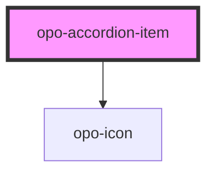

# opo-accordion-item

<!-- Auto Generated Below -->

## Properties

| Property             | Attribute       | Description                                             | Type                    | Default     |
| -------------------- | --------------- | ------------------------------------------------------- | ----------------------- | ----------- |
| `disabled`           | `disabled`      | Disables the item interaction.                          | `boolean`               | `false`     |
| `headingLevel`       | `heading-level` | Semantic heading level. Visual style remains unchanged. | `2 \| 3 \| 4 \| 5 \| 6` | `3`         |
| `label` _(required)_ | `label`         | Visible trigger label.                                  | `string`                | `undefined` |
| `value` _(required)_ | `value`         | Unique item value used by the parent accordion.         | `string`                | `undefined` |

## Shadow Parts

| Part            | Description |
| --------------- | ----------- |
| `"content"`     |             |
| `"heading"`     |             |
| `"item"`        |             |
| `"label"`       |             |
| `"panel"`       |             |
| `"panel-inner"` |             |
| `"trigger"`     |             |

## Dependencies

### Depends on

- [opo-icon](../opo-icon)

### Graph

----------------------------------------------

*Built with [StencilJS](https://stenciljs.com/)*
