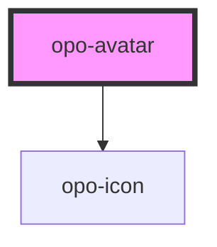

# opo-avatar

<!-- Auto Generated Below -->

## Properties

| Property       | Attribute       | Description                                                                                                                 | Type                   | Default     |
| -------------- | --------------- | --------------------------------------------------------------------------------------------------------------------------- | ---------------------- | ----------- |
| `alt`          | `alt`           | Accessible image description. Use an empty string when the avatar is decorative or when the name is already visible nearby. | `string`               | `""`        |
| `color`        | `color`         | Fallback color treatment.                                                                                                   | `"brand" \| "neutral"` | `"neutral"` |
| `fallback`     | `fallback`      | Fallback text, usually initials.                                                                                            | `string`               | `undefined` |
| `fallbackIcon` | `fallback-icon` | Fallback icon name used when there is no image or text fallback.                                                            | `string`               | `"user"`    |
| `size`         | `size`          | Visual size of the avatar.                                                                                                  | `"lg" \| "md" \| "sm"` | `"md"`      |
| `src`          | `src`           | Image source.                                                                                                               | `string`               | `undefined` |

## Shadow Parts

| Part         | Description |
| ------------ | ----------- |
| `"base"`     |             |
| `"fallback"` |             |
| `"image"`    |             |

## Dependencies

### Depends on

- [opo-icon](../opo-icon)

### Graph

----------------------------------------------

*Built with [StencilJS](https://stenciljs.com/)*
