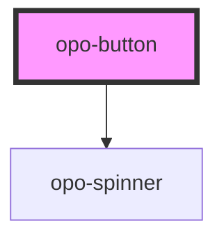

# opo-button

<!-- Auto Generated Below -->

## Properties

| Property    | Attribute    | Description                                                                            | Type                                                   | Default     |
| ----------- | ------------ | -------------------------------------------------------------------------------------- | ------------------------------------------------------ | ----------- |
| `ariaLabel` | `aria-label` | Accessible label. Required when the button has no visible text, eg: icon-only buttons. | `string`                                               | `undefined` |
| `disabled`  | `disabled`   | Disables the button.                                                                   | `boolean`                                              | `false`     |
| `fullWidth` | `full-width` | Makes the button take the full available width.                                        | `boolean`                                              | `false`     |
| `iconOnly`  | `icon-only`  | Renders the button as an icon-only button.                                             | `boolean`                                              | `false`     |
| `loading`   | `loading`    | Shows a loading state and prevents interaction.                                        | `boolean`                                              | `false`     |
| `size`      | `size`       | Visual size of the button.                                                             | `"lg" \| "md" \| "sm"`                                 | `"md"`      |
| `type`      | `type`       | Native button type.                                                                    | `"button" \| "reset" \| "submit"`                      | `"button"`  |
| `variant`   | `variant`    | Visual style of the button.                                                            | `"destructive" \| "ghost" \| "primary" \| "secondary"` | `"primary"` |

## Shadow Parts

| Part           | Description |
| -------------- | ----------- |
| `"base"`       |             |
| `"icon-end"`   |             |
| `"icon-start"` |             |
| `"label"`      |             |
| `"loader"`     |             |

## Dependencies

### Depends on

- [opo-spinner](../opo-spinner)

### Graph

----------------------------------------------

*Built with [StencilJS](https://stenciljs.com/)*
