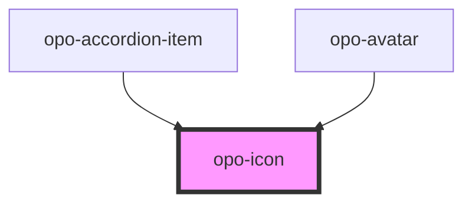

# opo-icon

<!-- Auto Generated Below -->

## Properties

| Property    | Attribute    | Description                              | Type                                                             | Default                   |
| ----------- | ------------ | ---------------------------------------- | ---------------------------------------------------------------- | ------------------------- |
| `ariaLabel` | `aria-label` | Accessible label for meaningful icons.   | `string`                                                         | `undefined`               |
| `color`     | `color`      | Semantic color of the icon.              | `"danger" \| "primary" \| "secondary" \| "success" \| "warning"` | `undefined`               |
| `name`      | `name`       | Icon name from the SVG sprite.           | `string`                                                         | `undefined`               |
| `size`      | `size`       | Visual size of the icon.                 | `"lg" \| "md" \| "sm"`                                           | `"md"`                    |
| `spinning`  | `spinning`   | Applies a continuous spinning animation. | `boolean`                                                        | `false`                   |
| `spriteUrl` | `sprite-url` | Custom path to the SVG sprite file.      | `string`                                                         | `"/icons/opo-sprite.svg"` |

## Shadow Parts

| Part       | Description |
| ---------- | ----------- |
| `"base"`   |             |
| `"custom"` |             |
| `"svg"`    |             |

## Dependencies

### Used by

 - [opo-accordion-item](../opo-accordion)
 - [opo-avatar](../opo-avatar)

### Graph

----------------------------------------------

*Built with [StencilJS](https://stenciljs.com/)*
