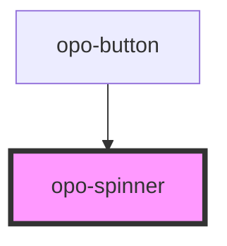

# opo-spinner

<!-- Auto Generated Below -->

## Properties

| Property | Attribute | Description | Type                   | Default |
| -------- | --------- | ----------- | ---------------------- | ------- |
| `size`   | `size`    |             | `"lg" \| "md" \| "sm"` | `"md"`  |

## Shadow Parts

| Part     | Description |
| -------- | ----------- |
| `"base"` |             |

## Dependencies

### Used by

 - [opo-button](../opo-button)

### Graph

----------------------------------------------

*Built with [StencilJS](https://stenciljs.com/)*
